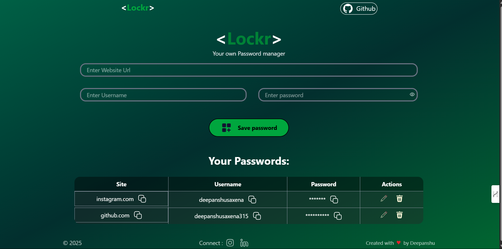

# 🔐 Lockr - Your Personal Password Manager

Lockr is a secure, modern password manager built with **React** and **MongoDB**, providing users with the ability to store, manage, and copy their credentials effortlessly. The frontend is deployed on **Vercel** and the backend on **Render**.

---

## 🚀 Demo

🔗 **Live Demo**: [https://lockr-password-manager.vercel.app](https://lockr-password-manager.vercel.app)



---

## 🛠️ Tech Stack

- **Frontend**: Vite + React + Tailwind CSS  
- **Backend**: Node.js + Express  
- **Database**: MongoDB Atlas  
- **Icons**: hugeicons-react, Lordicon  
- **Notifications**: react-toastify  
- **Deployment**:
  - **Frontend**: Vercel  
  - **Backend**: Render  

---

## 📂 Features

- 🔐 Add, edit, and delete website credentials  
- 📋 Copy site, username, or password to clipboard  
- 👁️ Toggle password visibility  
- 🔃 Realtime sync with backend (MongoDB)  
- 💬 Toast notifications for actions  
- ♻️ Fully responsive and mobile-friendly  

---

## 🌐 Backend

The backend is deployed on **Render** and connected to **MongoDB Atlas**.

🔗 **Backend URL**: [https://lockr-password-manager-backend.onrender.com](https://lockr-password-manager-backend.onrender.com)


## ⚙️ Environment Variables

Create a `.env` file at the root of your project and add:

```env
VITE_API_URL=https://lockr-password-manager-backend.onrender.com
```

# Clone the repository
git clone https://github.com/deepanshusaxena315/Lockr-Password-Manager.git
cd Lockr-Password-Manager

# Install dependencies
npm install

# Start the app
npm run dev

---
# 🙌 Credits
 - Created with ❤️ by Deepanshu Saxena